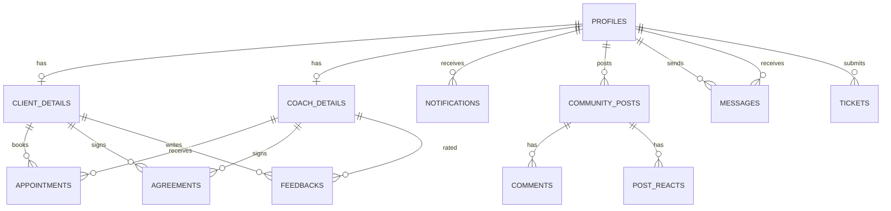

# GrooveSystem Migration Plan: Laravel to Next.js + Supabase

## Executive Summary & Audit Overview
This audit meticulously inspects every component of the GrooveSystem Laravel codebase (database migrations, models, routes, controllers, middleware, views, assets, and storage) to identify **REAL/ACTIVE** features and separate them from **UNUSED, OLD, TEST, DUPLICATE, or DISCONNECTED** code.

The existing Laravel MySQL database remains **completely untouched**. The new application will be a modern, highly responsive Next.js (App Router, TypeScript, Tailwind CSS, React) application backed by **Supabase** (PostgreSQL, Supabase Auth, Row-Level Security, Storage Buckets, and Realtime Subscriptions).

---

## 1. Feature & File Audit Inventory

| # | Feature Domain | Real/Active Laravel Feature | Relevant Laravel Files | Supabase / Next.js Replacement | Status | Notes / Disconnected Code Analysis |
|---|---|---|---|---|---|---|
| **1** | **Landing / Welcome** | Public landing page with showcase, stats, talents preview, navigation to login/register, contact form & public ticket submission. | `routes/web.php` (Route `/`), `resources/views/wc.blade.php`, `resources/js/wc.js`, `resources/views/termsandcon.blade.php` | `app/(public)/page.tsx`, `app/(public)/terms/page.tsx`, `components/public/Hero.tsx`, `components/public/TalentsSection.tsx` | **ACTIVE / CONNECTED / REQUIRED** | Fully active landing page. Self-contained styling and interactions. |
| **2** | **Multi-Role Authentication & Passcode Verification** | Unified Login for Client, Coach, and Admin. Custom email verification UUID flow. Admin 6-digit 2FA passcode via email. Password reset token flow. | `app/Http/Controllers/LoginController.php`, `app/Notifications/VerifyEmail.php`, `app/Notifications/AdminPasscodeNotification.php`, `app/Notifications/ResetPassword.php`, `resources/views/login.blade.php`, `resources/views/ForgetPassword.php` | Supabase Auth (`auth.users`) + custom `user_roles` (`admin`, `coach`, `client`) metadata, Next.js Middleware session guards, Supabase Auth OTP/email verification, `app/(auth)/login/page.tsx`, `app/(auth)/forgot-password/page.tsx`, `app/(auth)/reset-password/page.tsx`, `app/(auth)/verify-email/page.tsx`, `app/admin/verify-passcode/page.tsx` | **ACTIVE / CONNECTED / REQUIRED** | Replaces multi-guard session authentication with unified Supabase Auth + JWT metadata + Row Level Security (RLS). |
| **3** | **Address Selection & Registration Flow** | Multi-step PH standard address selection (Region, Province, City/Municipality, Barangay) for Client & Coach registrations. File upload for ID and selfie proofs. | `app/Http/Controllers/AddressController.php`, `app/Http/Controllers/ClientController.php` (`Clientregister`, `ClientStore`), `app/Http/Controllers/CoachController.php` (`CoachRegister`, `CoachStore`), `resources/views/ConfirmAddress.blade.php`, `resources/views/Client/register.blade.php`, `resources/views/Coach/Register.blade.php` | `app/(auth)/register/client/page.tsx`, `app/(auth)/register/coach/page.tsx`, `components/auth/AddressSelector.tsx` (using PSGC API / static PH Geo JSON), Supabase Storage bucket (`verification-documents`), Server Action for registration submission | **ACTIVE / CONNECTED / REQUIRED** | Session temporary storage replaced with React Hook Form / client state and direct Server Action registration. |
| **4** | **Client Portal & Dashboard** | Client home view with trending coaches, top approved coaches, recent activity feed, announcement modal/banner, top talent pills. | `app/Http/Controllers/DashboardController.php` (`showDashboard`), `app/Http/Controllers/ClientController.php` (`dashboard`), `resources/views/Client/home.blade.php` | `app/(client)/client/home/page.tsx`, `components/dashboard/TrendingCoaches.tsx`, `components/dashboard/TopTalents.tsx`, `components/announcements/AnnouncementBanner.tsx` | **ACTIVE / CONNECTED / REQUIRED** | Uses Server Components with Supabase query caching for lightning-fast loads. |
| **5** | **Coach Portal & Dashboard** | Coach home view with scheduled appointments list, top talent demand, top verified coaches, active system maintenance notice alert. | `app/Http/Controllers/DashboardController.php`, `resources/views/Coach/Home.blade.php` | `app/(coach)/coach/home/page.tsx`, `components/coach/UpcomingSessions.tsx`, `components/maintenance/MaintenanceBanner.tsx` | **ACTIVE / CONNECTED / REQUIRED** | Realtime subscription updates when new appointment requests arrive. |
| **6** | **Coach Discovery & Directory (Talents Page)** | Public & authenticated coach browsing, filter by talent (Dance, Singing, Acting, Theater), genres, location/city/barangay, max service fee. | `app/Http/Controllers/CoachController.php` (`index`, `Talents`), `app/Http/Controllers/PageController.php` (`index`), `resources/views/coaches/index.blade.php`, `resources/views/Client/talent.blade.php`, `resources/views/Coach/Talent.blade.php` | `app/(client)/talent/page.tsx`, `app/(coach)/talents/page.tsx`, `components/talent/CoachCard.tsx`, `components/talent/CoachFilterBar.tsx` | **ACTIVE / CONNECTED / REQUIRED** | Database queries with Supabase Full-Text & JSONB/ILIKE search for talent, genre, and location. |
| **7** | **Appointment Booking & Management** | Client books F2F appointment with coach; Coach confirms, declines, or marks completed; Client cancels; Client submits post-session rating & feedback; Notifications dispatched to client, coach, admin. | `app/Http/Controllers/AppointmentController.php`, `app/Models/Appointment.php`, `resources/views/appointments/appointmentdata.blade.php`, `resources/views/Client/calendar.blade.php`, `resources/views/Coach/Calendar.blade.php` | `app/(client)/appointments/page.tsx`, `app/(coach)/appointments/page.tsx`, `app/calendar/page.tsx`, `components/appointments/BookingModal.tsx`, `components/appointments/FeedbackModal.tsx`, `components/calendar/CalendarView.tsx` | **ACTIVE / CONNECTED / REQUIRED** | Uses Supabase Postgres `appointments` table with RLS and status enum (`pending`, `confirmed`, `declined`, `cancelled`, `completed`). |
| **8** | **Digital Agreement & Signature Contracts** | Client & Coach contract agreement before sessions; Canvas signature capture (PNG); Auto PDF generation with signatures and terms; Attached to message thread. | `app/Http/Controllers/ContractController.php`, `app/Models/Agreement.php`, `app/Mail/SendAgreementPdf.php`, `resources/views/contracts/AgreementForm.blade.php`, `resources/views/contracts/FINALAgreementForm.blade.php`, `resources/views/contracts/ClientAgree.blade.php` | `app/contracts/[id]/page.tsx`, `components/contracts/SignaturePad.tsx`, `@react-pdf/renderer` or Edge Route PDF generator, Supabase Storage bucket (`contracts`) | **ACTIVE / CONNECTED / REQUIRED** | Replaces heavy `barryvdh/laravel-dompdf` with modern React PDF server generation + Supabase storage signed URLs. |
| **9** | **Live Messaging & Chat (Direct Messenger)** | Client-to-Coach and Coach-to-Client chat, media attachments (images, video, audio, docs), location share, embedded agreement preview, realtime messaging. | `app/Http/Controllers/MessageController.php`, `app/Models/Message.php`, `app/Events/MessageSent.php`, `routes/channels.php`, `resources/views/Client/messenger.blade.php`, `resources/views/Coach/Messenger.blade.php` | `app/(shared)/messages/page.tsx`, `components/chat/ChatWindow.tsx`, `components/chat/ConversationList.tsx`, `components/chat/MessageBubble.tsx`, Supabase Realtime Channels (`messages` table updates & broadcast) | **ACTIVE / CONNECTED / REQUIRED** | Replaces Laravel Broadcast / Pusher / polling with native Supabase Realtime WebSockets. |
| **10** | **Community Feeds & Media Posts** | Video/Photo talent sharing board categorized by talent (Dance, Singing, Acting, Theater), like/react toggle, comment threads, author deletion. | `app/Http/Controllers/CommunityPostController.php`, `app/Models/CommunityPost.php`, `app/Models/Comment.php`, `app/Models/PostReact.php`, `resources/views/Client/talent.blade.php` (Community tab), `resources/views/Coach/Talent.blade.php` | `components/community/CommunityFeed.tsx`, `components/community/PostCard.tsx`, `components/community/CreatePostModal.tsx`, `components/community/CommentSection.tsx` | **ACTIVE / CONNECTED / REQUIRED** | Supabase Postgres tables `community_posts`, `comments`, `post_reacts` with real-time counters. |
| **11** | **User Profile & Portfolio Showcase** | Client & Coach profiles; Profile edit (bio, talent, fees, cancellation terms, contact); Avatar upload; Client & Coach portfolio post grids; Public other-profile viewer. | `app/Http/Controllers/ClientProfilePostController.php`, `app/Http/Controllers/CoachProfilePostController.php`, `app/Http/Controllers/PageController.php` (`showProfile`), `resources/views/Client/profile.blade.php`, `resources/views/Coach/Profile.blade.php`, `resources/views/Client/otherprofile.blade.php`, `resources/views/Coach/OTHERPROFILE.blade.php` | `app/(client)/client/profile/page.tsx`, `app/(coach)/coach/profile/page.tsx`, `app/userprofile/[id]/page.tsx`, `components/profile/ProfilePostGrid.tsx`, `components/profile/EditProfileForm.tsx` | **ACTIVE / CONNECTED / REQUIRED** | Clean unified profile view components for Client and Coach. |
| **12** | **Feedback & Ratings** | Star rating (1-5) and testimonial text left by clients on coaches; Aggregated rating score on coach cards and profiles. | `app/Http/Controllers/FeedbackController.php`, `app/Models/Feedback.php` | `app/api/feedback/route.ts`, `components/feedback/FeedbackList.tsx`, `components/feedback/RatingStars.tsx` | **ACTIVE / CONNECTED / REQUIRED** | Stored in `feedbacks` table with foreign keys and automatic average rating aggregation view. |
| **13** | **AI Coach Assistant (Chatbot)** | DeepSeek / OpenRouter AI assistant answering questions about coach specialization, terms, fees, and booking tips when coach is offline/busy. | `app/Http/Controllers/ChatbotController.php`, `resources/views/chatbot.blade.php` | `app/api/ai/coach-assistant/route.ts`, `components/ai/CoachAIAssistantModal.tsx` | **ACTIVE / CONNECTED / REQUIRED** | Next.js Edge Route Handler calling OpenRouter API with streamed response to UI. |
| **14** | **Admin Control Panel** | Admin dashboard (metrics, activity charts, user distribution by talent, recent appointments/agreements), User approval & suspension management, Theme settings, System maintenance notices, Support tickets triage, Announcement broadcast. | `app/Http/Controllers/AdminController.php`, `resources/views/Admin/AdminDashboard.blade.php`, `resources/views/Admin/AdminUsers.blade.php`, `resources/views/Admin/AdminControl.blade.php`, `resources/views/Admin/AdminMaintenance.blade.php`, `resources/views/Admin/AdminTickets.blade.php`, `resources/views/Admin/AdminTransaction.blade.php` | `app/admin/dashboard/page.tsx`, `app/admin/users/page.tsx`, `app/admin/tickets/page.tsx`, `app/admin/maintenance/page.tsx`, `app/admin/settings/page.tsx`, `app/admin/transactions/page.tsx` | **ACTIVE / CONNECTED / REQUIRED** | Protected by Admin role RLS and Next.js middleware. |
| **15** | **Public Support Ticket System** | Guest/user ticket submission with attachment, admin resolution, confirmation email dispatch. | `app/Http/Controllers/PublicTicketController.php`, `app/Models/Ticket.php`, `resources/views/emails/ticket.blade.php` | `app/(public)/contact/page.tsx`, `app/api/tickets/route.ts`, Supabase Resend / SMTP integration for notifications | **ACTIVE / CONNECTED / REQUIRED** | Tickets stored in `tickets` table with admin resolution workflows. |
| **16** | **Global Notifications System** | In-app notification bell, unread count badge, toast updates for bookings, approvals, messages, announcements, and maintenance alerts. | `app/Notifications/GrooveNotification.php`, `app/Http/Controllers/Concerns/SendsGrooveNotifications.php`, `database/migrations/2025_08_19_094829_create_notifications_table.php` | `components/notifications/NotificationDropdown.tsx`, Supabase `notifications` table with Realtime INSERT listener | **ACTIVE / CONNECTED / REQUIRED** | Instant real-time toast alerts and persistent notifications bell. |
| **17** | **System Maintenance Notices** | Real-time global banner for scheduled maintenance, downtime windows, and deploy notices created by admins. | `app/Models/MaintenanceNotice.php`, `database/migrations/2025_10_06_185335_create_maintenance_notices_table.php` | `components/maintenance/GlobalMaintenanceNotice.tsx`, Supabase query for active notices | **ACTIVE / CONNECTED / REQUIRED** | Banner displayed across all layouts when an active notice is present. |
| **18** | **System Theme Switcher** | Light / Dark / Ocean / Halloween themes configured in settings. | `app/Models/Setting.php`, `app/Http/Middleware/ApplyTheme.php`, `database/migrations/2025_09_19_083141_create_settings_table.php` | Tailwind CSS themes + `next-themes` / CSS variables | **ACTIVE / CONNECTED / REQUIRED** | Instant client-side theme switching with admin global default fallback. |
| **19** | **SMS Logging / Compose** | Isolated SMS composer view with non-existent route `sms.send`. | `resources/views/sms_compose.blade.php`, `app/Models/SmsLog.php`, `database/migrations/2025_09_14_155725_create_sms_logs_table.php` | **DO NOT MIGRATE** | **UNUSED / OLD / DISCONNECTED** | The route `sms.send` is nowhere in `routes/web.php`. No active SMS provider is configured. Table `sms_logs` is not used by any active feature. |
| **20** | **Bugs Table** | Empty migration table with `fixed_at`. | `database/migrations/2025_08_05_223243_create_bugs_table.php` | **DO NOT MIGRATE** | **UNUSED / OLD** | No model exists. Dashboard only references hardcoded `'bugs_fixed' => 12`. |
| **21** | **Default Laravel Starter Tables** | Default `users`, `password_reset_tokens`, `sessions`, `cache`, `jobs`, `failed_jobs`. | `0001_01_01_000000_create_users_table.php`, `0001_01_01_000001_create_cache_table.php`, `0001_01_01_000002_create_jobs_table.php` | **DO NOT MIGRATE** | **UNUSED / PLACEHOLDER** | The active system uses separate `clients`, `coaches`, `admins` tables. Supabase Auth manages sessions and tokens natively. |
| **22** | **Stray Root Files & Typos** | Garbage/stray files created during past CLI commands or typos: `.about}`, `.availability}`, `appointment_price}`, `session_duration}`, `payment_method`, `firstname`, `lastname`, `genre`, `talent`, `main`, `page.html`, `cookies.txt`, `appServicesSmartChatService.php`. | Workspace root files | **DO NOT MIGRATE** | **TEST / PLACEHOLDER / STRAY** | Accidental dump files from terminal redirects. Not part of any application logic. |
| **23** | **Theme Test Blade** | Standalone test blade for theme preview. | `resources/views/test.blade.php` | **DO NOT MIGRATE** | **TEST / PLACEHOLDER** | Not linked in `web.php` or any menu. |

---

## 2. Supabase Database Architecture

The Supabase database will consolidate the separate `clients`, `coaches`, and `admins` models into a clean PostgreSQL schema with strict foreign keys, indexes, Row Level Security (RLS) policies, and typed enums.



### Table Definitions

#### 1. `profiles` (Unified User Table linked to `auth.users`)
- `id` (UUID, PK, references `auth.users.id` on delete cascade)
- `custom_id` (VARCHAR(10), UNIQUE, indexed) — preserves `0001` or `C001` format
- `role` (ENUM: `'client'`, `'coach'`, `'admin'`)
- `firstname` (VARCHAR(100), NOT NULL)
- `middlename` (VARCHAR(100))
- `lastname` (VARCHAR(100), NOT NULL)
- `suffix` (VARCHAR(20))
- `birthdate` (DATE)
- `contact` (VARCHAR(30))
- `email` (VARCHAR(255), UNIQUE, NOT NULL)
- `username` (VARCHAR(60), UNIQUE, NOT NULL)
- `photo_url` (TEXT)
- `bio` (TEXT)
- `status` (ENUM: `'active'`, `'pending'`, `'suspended'`, `'offline'`, `'online'`, `'busy'`, `'away'`)
- `address_summary` (TEXT)
- `region_code` (VARCHAR(20))
- `province_code` (VARCHAR(20))
- `city_code` (VARCHAR(20))
- `barangay_code` (VARCHAR(20))
- `region_name` (VARCHAR(120))
- `province_name` (VARCHAR(120))
- `city_name` (VARCHAR(120))
- `barangay_name` (VARCHAR(120))
- `street` (VARCHAR(160))
- `postal_code` (VARCHAR(20))
- `terms_accepted` (BOOLEAN DEFAULT TRUE)
- `email_verified` (BOOLEAN DEFAULT FALSE)
- `account_verified` (BOOLEAN DEFAULT FALSE)
- `approved_at` (TIMESTAMPTZ)
- `approved_by` (UUID, references `profiles.id`)
- `created_at` (TIMESTAMPTZ DEFAULT NOW())
- `updated_at` (TIMESTAMPTZ DEFAULT NOW())

#### 2. `coach_profiles` (Coach-Specific Details)
- `id` (UUID, PK, references `profiles.id` on delete cascade)
- `coach_id` (VARCHAR(10), UNIQUE, indexed)
- `talents` (TEXT, NOT NULL) — e.g. "Dance, Singing"
- `genres` (TEXT) — e.g. "Hip-Hop, Contemporary"
- `service_fee` (INTEGER DEFAULT 0)
- `duration` (VARCHAR(50))
- `payment_type` (ENUM: `'cash'`, `'online'`)
- `payment_provider` (VARCHAR(50))
- `payment_handle` (VARCHAR(150))
- `notice_hours` (INTEGER DEFAULT 0)
- `notice_days` (INTEGER DEFAULT 0)
- `cancellation_method` (VARCHAR(255))
- `portfolio_path` (TEXT)
- `valid_id_path` (TEXT)
- `id_selfie_path` (TEXT)
- `created_at` (TIMESTAMPTZ DEFAULT NOW())
- `updated_at` (TIMESTAMPTZ DEFAULT NOW())

#### 3. `client_profiles` (Client-Specific Details)
- `id` (UUID, PK, references `profiles.id` on delete cascade)
- `client_id` (VARCHAR(10), UNIQUE, indexed)
- `talent` (VARCHAR(100) DEFAULT 'N/A')
- `valid_id_path` (TEXT)
- `created_at` (TIMESTAMPTZ DEFAULT NOW())
- `updated_at` (TIMESTAMPTZ DEFAULT NOW())

#### 4. `appointments`
- `id` (BIGINT GENERATED ALWAYS AS IDENTITY PK)
- `appointment_id` (INTEGER UNIQUE NOT NULL) — 5 digit ID
- `client_id` (UUID NOT NULL, references `profiles.id` on delete cascade)
- `coach_id` (UUID NOT NULL, references `profiles.id` on delete cascade)
- `name` (VARCHAR(255) NOT NULL)
- `email` (VARCHAR(255) NOT NULL)
- `contact` (VARCHAR(30) NOT NULL)
- `address` (TEXT NOT NULL)
- `date` (DATE NOT NULL)
- `start_time` (VARCHAR(20) NOT NULL)
- `end_time` (VARCHAR(20) NOT NULL)
- `session_type` (VARCHAR(50) DEFAULT 'F2F')
- `talent` (VARCHAR(100))
- `experience` (VARCHAR(255) NOT NULL)
- `purpose` (VARCHAR(255) NOT NULL)
- `message` (TEXT)
- `status` (ENUM: `'pending'`, `'confirmed'`, `'declined'`, `'cancelled'`, `'completed'`)
- `feedback` (TEXT)
- `rating` (SMALLINT CHECK (rating >= 1 AND rating <= 5))
- `created_at` (TIMESTAMPTZ DEFAULT NOW())
- `updated_at` (TIMESTAMPTZ DEFAULT NOW())

#### 5. `agreements`
- `id` (BIGINT GENERATED ALWAYS AS IDENTITY PK)
- `client_id` (UUID NOT NULL, references `profiles.id` on delete cascade)
- `coach_id` (UUID NOT NULL, references `profiles.id` on delete cascade)
- `agreement_date` (DATE)
- `appointment_price` (VARCHAR(50))
- `session_duration` (VARCHAR(50))
- `payment_method` (VARCHAR(50))
- `notice_hours` (INTEGER)
- `notice_days` (INTEGER)
- `cancellation_method` (VARCHAR(255))
- `client_signature_path` (TEXT)
- `coach_signature_path` (TEXT)
- `agreement_pdf_path` (TEXT)
- `created_at` (TIMESTAMPTZ DEFAULT NOW())
- `updated_at` (TIMESTAMPTZ DEFAULT NOW())

#### 6. `messages`
- `id` (BIGINT GENERATED ALWAYS AS IDENTITY PK)
- `sender_id` (UUID NOT NULL, references `profiles.id` on delete cascade)
- `receiver_id` (UUID NOT NULL, references `profiles.id` on delete cascade)
- `message` (TEXT)
- `media_path` (TEXT)
- `location_url` (TEXT)
- `edited_at` (TIMESTAMPTZ)
- `deleted_at` (TIMESTAMPTZ)
- `created_at` (TIMESTAMPTZ DEFAULT NOW())
- `updated_at` (TIMESTAMPTZ DEFAULT NOW())

#### 7. `community_posts`
- `id` (BIGINT GENERATED ALWAYS AS IDENTITY PK)
- `author_id` (UUID NOT NULL, references `profiles.id` on delete cascade)
- `caption` (TEXT NOT NULL)
- `media_path` (TEXT)
- `talent` (VARCHAR(50) NOT NULL)
- `created_at` (TIMESTAMPTZ DEFAULT NOW())
- `updated_at` (TIMESTAMPTZ DEFAULT NOW())

#### 8. `comments`
- `id` (BIGINT GENERATED ALWAYS AS IDENTITY PK)
- `post_id` (BIGINT NOT NULL, references `community_posts.id` on delete cascade)
- `user_id` (UUID NOT NULL, references `profiles.id` on delete cascade)
- `body` (TEXT NOT NULL)
- `created_at` (TIMESTAMPTZ DEFAULT NOW())
- `updated_at` (TIMESTAMPTZ DEFAULT NOW())

#### 9. `post_reacts`
- `id` (BIGINT GENERATED ALWAYS AS IDENTITY PK)
- `post_id` (BIGINT NOT NULL, references `community_posts.id` on delete cascade)
- `user_id` (UUID NOT NULL, references `profiles.id` on delete cascade)
- `created_at` (TIMESTAMPTZ DEFAULT NOW())
- CONSTRAINT `unique_post_react` UNIQUE (`post_id`, `user_id`)

#### 10. `user_profile_posts` (Client & Coach Showcase Posts)
- `id` (BIGINT GENERATED ALWAYS AS IDENTITY PK)
- `user_id` (UUID NOT NULL, references `profiles.id` on delete cascade)
- `media_path` (TEXT NOT NULL)
- `caption` (TEXT)
- `created_at` (TIMESTAMPTZ DEFAULT NOW())
- `updated_at` (TIMESTAMPTZ DEFAULT NOW())

#### 11. `feedbacks`
- `id` (BIGINT GENERATED ALWAYS AS IDENTITY PK)
- `coach_id` (UUID NOT NULL, references `profiles.id` on delete cascade)
- `user_id` (UUID NOT NULL, references `profiles.id` on delete cascade)
- `rating` (SMALLINT NOT NULL CHECK (rating >= 1 AND rating <= 5))
- `comment` (VARCHAR(500) NOT NULL)
- `created_at` (TIMESTAMPTZ DEFAULT NOW())
- `updated_at` (TIMESTAMPTZ DEFAULT NOW())

#### 12. `notifications`
- `id` (UUID PRIMARY KEY DEFAULT gen_random_uuid())
- `user_id` (UUID NOT NULL, references `profiles.id` on delete cascade)
- `title` (VARCHAR(255) NOT NULL)
- `message` (TEXT NOT NULL)
- `cta_url` (TEXT)
- `read_at` (TIMESTAMPTZ)
- `created_at` (TIMESTAMPTZ DEFAULT NOW())

#### 13. `announcements`
- `id` (BIGINT GENERATED ALWAYS AS IDENTITY PK)
- `title` (VARCHAR(255))
- `message` (TEXT NOT NULL)
- `author` (VARCHAR(100) DEFAULT 'Admin')
- `cta_url` (TEXT)
- `cta_label` (VARCHAR(100))
- `created_at` (TIMESTAMPTZ DEFAULT NOW())

#### 14. `maintenance_notices`
- `id` (BIGINT GENERATED ALWAYS AS IDENTITY PK)
- `title` (VARCHAR(255))
- `type` (VARCHAR(50) DEFAULT 'maintenance')
- `message` (TEXT NOT NULL)
- `is_active` (BOOLEAN DEFAULT TRUE)
- `starts_at` (TIMESTAMPTZ)
- `ends_at` (TIMESTAMPTZ)
- `created_by` (VARCHAR(100) DEFAULT 'Admin')
- `created_at` (TIMESTAMPTZ DEFAULT NOW())

#### 15. `tickets`
- `id` (BIGINT GENERATED ALWAYS AS IDENTITY PK)
- `user_id` (UUID, references `profiles.id` on delete set null)
- `name` (VARCHAR(120) NOT NULL)
- `email` (VARCHAR(255) NOT NULL)
- `subject` (VARCHAR(160) NOT NULL)
- `message` (TEXT NOT NULL)
- `status` (VARCHAR(30) DEFAULT 'open')
- `priority` (VARCHAR(30) DEFAULT 'normal')
- `attachment_path` (TEXT)
- `attachment_name` (VARCHAR(255))
- `attachment_mime` (VARCHAR(100))
- `attachment_size` (BIGINT)
- `created_at` (TIMESTAMPTZ DEFAULT NOW())
- `updated_at` (TIMESTAMPTZ DEFAULT NOW())

#### 16. `system_settings`
- `key` (VARCHAR(100) PRIMARY KEY)
- `value` (TEXT)
- `updated_at` (TIMESTAMPTZ DEFAULT NOW())

---

## 3. Authentication & Authorization Approach

### Auth Strategy
1. **Supabase Auth as Single Identity Provider**:
   - `auth.users` handles secure password hashing, sessions, refresh tokens, and email verification.
   - User metadata contains `role` (`'client'`, `'coach'`, `'admin'`).
   - On user registration, a PostgreSQL trigger automatically inserts into `public.profiles` with `id = auth.uid()`.
2. **Next.js Middleware Guard**:
   - `@supabase/ssr` handles cookie-based authentication for Server Components and Route Handlers.
   - Middleware inspects the user role and route path:
     - `/admin/*` → requires `role === 'admin'`. If passcode verification is pending, redirects to passcode modal.
     - `/client/*` → requires `role === 'client'`.
     - `/coach/*` → requires `role === 'coach'`.
     - `/messages/*`, `/appointments/*`, `/talent/*` → requires logged in client or coach.
3. **Row-Level Security (RLS)**:
   - Clients can only edit their own profile, appointments, messages, and posts.
   - Coaches can only edit their rate settings, appointments assigned to them, and sent messages.
   - Admins possess full CRUD oversight on user approvals, tickets, notices, and announcements.

---

## 4. Proposed Next.js Project Structure

```
GrooveSystem-Next/
├── app/
│   ├── (public)/                     # Public marketing & informational pages
│   │   ├── page.tsx                  # Landing (wc.blade.php)
│   │   ├── terms/page.tsx            # Terms & Conditions (termsandcon.blade.php)
│   │   ├── about/page.tsx            # Public / Shared About
│   │   └── contact/page.tsx          # Contact / Public Ticket Submission
│   ├── (auth)/                       # Authentication pages
│   │   ├── login/page.tsx            # Unified login (Client, Coach, Admin)
│   │   ├── register/
│   │   │   ├── client/page.tsx       # Client registration + address picker
│   │   │   └── coach/page.tsx        # Coach registration + rate + proof upload
│   │   ├── forgot-password/page.tsx  # Password reset request
│   │   ├── reset-password/page.tsx   # Password reset confirm
│   │   └── verify-email/page.tsx     # Email verification completion
│   ├── (client)/                     # Client protected area
│   │   ├── layout.tsx                # Client Header, Nav, Notifications, Theme
│   │   └── client/
│   │       ├── home/page.tsx         # Client dashboard
│   │       └── profile/
│   │           ├── page.tsx          # Client profile view & posts
│   │           └── edit/page.tsx     # Client profile edit
│   ├── (coach)/                      # Coach protected area
│   │   ├── layout.tsx                # Coach Header, Nav, Notifications, Theme
│   │   └── coach/
│   │       ├── home/page.tsx         # Coach dashboard
│   │       ├── profile/
│   │       │   ├── page.tsx          # Coach profile, rating stats, appointments
│   │       │   └── edit/page.tsx     # Coach profile & rate edit
│   │       └── status/page.tsx       # Online/Busy/Away toggle
│   ├── (shared-app)/                 # Shared authenticated features (Client + Coach)
│   │   ├── layout.tsx                # Shared layout
│   │   ├── talent/page.tsx           # Directory of coaches + Community feed tabs
│   │   ├── userprofile/[id]/page.tsx # Public viewer for other users
│   │   ├── appointments/page.tsx     # Appointments list & management
│   │   ├── calendar/page.tsx         # Interactive booking calendar
│   │   ├── messages/page.tsx         # Realtime chat messenger
│   │   └── contracts/[id]/page.tsx   # Digital agreement viewer & signing
│   ├── admin/                        # Admin protected portal
│   │   ├── layout.tsx                # Admin sidebar, header, passcode guard
│   │   ├── dashboard/page.tsx        # Analytics, metrics, talent demand charts
│   │   ├── users/page.tsx            # Client & Coach approvals / suspensions
│   │   ├── tickets/page.tsx          # Support ticket triage & resolution
│   │   ├── maintenance/page.tsx      # System maintenance alerts manager
│   │   ├── transactions/page.tsx     # Agreement & appointment transaction logs
│   │   └── settings/page.tsx         # Theme control & system settings
│   └── api/                          # Server actions & Route handlers
│       ├── ai/coach-assistant/route.ts # OpenRouter / DeepSeek AI assistant
│       ├── webhooks/route.ts         # Supabase webhooks
│       └── tickets/route.ts          # Public ticket handling & email
├── components/
│   ├── ui/                           # Reusable UI primitives (Button, Modal, Input, Badge, Toast)
│   ├── public/                       # Hero, Talent Showcase, Nav, Footer
│   ├── auth/                         # AddressSelector, PasswordStrength, DocUpload
│   ├── chat/                         # ChatWindow, ConversationList, MessageBubble, LocationPicker
│   ├── appointments/                 # BookingModal, StatusBadge, FeedbackModal
│   ├── contracts/                    # SignaturePad, AgreementForm, PdfViewer
│   ├── community/                    # CommunityFeed, CreatePostModal, CommentSection
│   ├── notifications/                # NotificationDropdown, NotificationItem
│   ├── maintenance/                  # GlobalMaintenanceNotice, MaintenanceForm
│   └── theme/                        # ThemeProvider, ThemeSelector
├── lib/
│   ├── supabase/
│   │   ├── client.ts                 # Browser Supabase client
│   │   ├── server.ts                 # Server Component Supabase client
│   │   └── middleware.ts             # Auth middleware helper
│   ├── openrouter.ts                 # AI coach chatbot service
│   ├── types.ts                      # TypeScript database and domain definitions
│   └── utils.ts                      # Helpers (formatting, date, PH currency)
└── public/
    └── images/                       # Brand logos, avatars, icons
```

---

## 5. Phased Migration Plan

### Phase 1: Database Setup & Supabase Provisioning
1. Initialize Supabase project (PostgreSQL).
2. Execute SQL DDL script creating all 16 active tables, constraints, foreign keys, and indexes.
3. Configure Row-Level Security (RLS) policies for each role (`admin`, `coach`, `client`).
4. Set up Supabase Storage Buckets:
   - `avatars` (public)
   - `verification-documents` (private / admin only)
   - `community-media` (public)
   - `messages-media` (authenticated participants)
   - `signatures` (authenticated participants)
   - `contracts` (authenticated participants)
   - `tickets-attachments` (authenticated / admin)

### Phase 2: Next.js Foundation & Design System
1. Initialize Next.js 14+ (App Router, TypeScript, Tailwind CSS, Lucide icons).
2. Configure theme system (Light, Dark, Ocean, Halloween CSS token variables matching Laravel themes).
3. Set up `@supabase/ssr` authentication clients and middleware role routing.

### Phase 3: Authentication, Multi-Role Registration & Onboarding
1. Implement Unified Login with role auto-detection and redirection.
2. Build Client & Coach registration forms with interactive Philippine Geographic Address selector.
3. Implement ID document & selfie verification upload to Supabase storage.
4. Implement Admin 2FA Passcode verification.

### Phase 4: Core Client & Coach Features
1. Build Client and Coach Home Dashboards with real stats and announcement banners.
2. Build Coach Directory (Talent discovery) with live filters (Talent, Genre, Location, Max Fee).
3. Build Appointment Booking flow, Coach Confirmation/Decline actions, and Client Cancellation.
4. Implement interactive Calendar View for sessions.
5. Build Feedback and Star Rating submission system.

### Phase 5: Contracts, Realtime Chat & Community
1. Implement Signature Canvas pad and Agreement Form generation.
2. Implement Realtime Messenger with Supabase Realtime Channels (text, image, video, location, PDF agreement).
3. Implement Community Talent Feeds (Video/photo posting, like reacts, comments).
4. Implement AI Coach Assistant with OpenRouter API integration.

### Phase 6: Admin Management & System Governance
1. Build Admin Dashboard with talent charts, real user counts, and activity logs.
2. Implement Client and Coach verification approval/suspension tools.
3. Build System Maintenance Notice manager and broadcast announcement publisher.
4. Build Support Ticket resolution center.

### Phase 7: Verification & Testing
1. End-to-end testing across Client, Coach, and Admin personas.
2. Test responsive layouts on desktop, tablet, and mobile.
3. Ensure absolute data separation and zero interference with the reference Laravel database.
